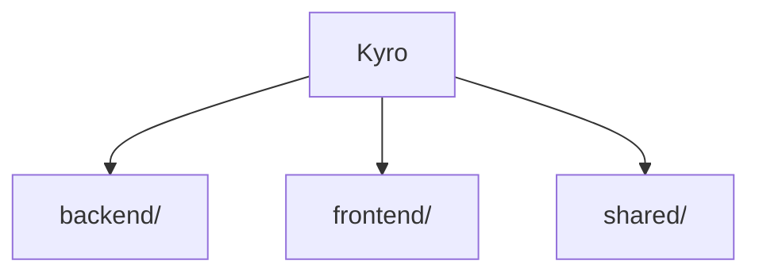

---
tags:
  - arquitectura
  - detalle
proyecto: Kyro
up: "[[Kyro]]"
actualizado: 2026-08-23
---

%% ficha %%
# Arquitectura de Kyro

El proyecto se reparte en 3 carpetas de primer nivel: `backend/`, `frontend/` y `shared/`.

## Estructura

```
Kyro/
  backend/
  frontend/
  shared/
  .gitignore
  .nvmrc
  README.md
  docker-compose.yml
  logo.png
  package-lock.json
  package.json
  railway.json
  vercel.json
```

## Mapa



## Lo que documenta el README

- Puesta en marcha
- Cuentas de ejemplo
- Si `npm run dev` falla en tu equipo
- Producción
- Despliegue
- El backend en Railway
- Arquitectura
- Tiempo real
- Llamadas y voz
- Pruebas
- Seguridad
- Qué hay hecho
- Qué está preparado pero todavía no implementado
- Comandos
- La marca

← [[Kyro]]
%% /ficha %%
